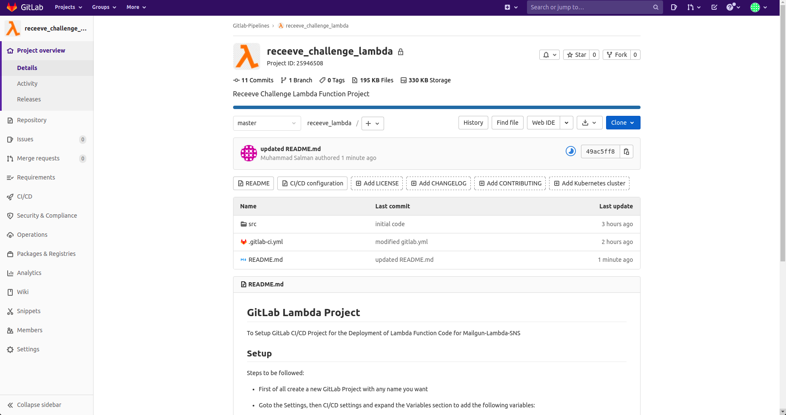

# GitLab Lambda Project

To Setup GitLab CI/CD Project for the Deployment of Lambda Function Code for Mailgun-Lambda-SNS

## Setup

Steps to be followed:

* First of all create a new GitLab Project with any name you want

* Goto the Settings, then CI/CD settings and expand the Variables section to add the following variables:
    - AWS_ACCESS_KEY_ID
    - AWS_SECRET_ACCESS_KEY
    - AWS_DEFAULT_REGION

* Now, clone the GitLab Infra Project repository and copy the code to new cloned repository or just initilize this repository as the GitLab Lambda Project repository

* Finally, Commit and Push the code to the GitLab Lambda Project repository

GitLab Pipeline will automatically trigger and deploy the code for the Lambda Function. You can watch the different Stages of the Pipeline in CI/CD section of the Project. It will deploy the following code files:

- aws_s3.py (Contains AWS S3 Storage Service)
- aws_sns.py (Contains AWS SNS Publishing Service)
- aws_ssm.py (Contains AWS SSM Secret Management Service)
- lambda_handler.py (Contains the Lambda Function Handler)

## GitLab Infra Project Overview

